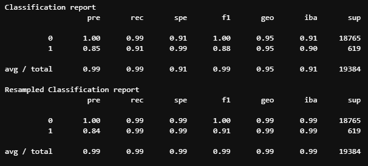

# Credit Risk Classification 

---

 This program is performing a comparison of two logistic regression models for loan risk prediction. The goal is to evaluate the effectiveness of using oversampled data to improve this model's performance in identifying high-risk loans while minimizing false positives.

* This program starts by fitting a logistic regression model on the original training data. It then makes predictions on the testing data and evaluates the model's performance using various metrics such as precision, recall, specificity, and F1 score.

* Next, this program applies oversampling to the training data using the RandomOverSampler technique from the imbalanced-learn library. The logistic regression model is then fitted on The resampled training data. Again, predictions are made on the testing data, and the model's performance is evaluated using the same metrics.

 By comparing the performance metrics of the two models, This program aims to determine whether the model trained with oversampled data outperforms the model trained on the original data. This comparison helps assess the effectiveness of oversampling in improving This model's ability to identify high-risk loans accurately while maintaining a reasonable false positive rate.

* Comparing the evaluation metrics, the model with oversampled data shows improvements in various aspects. The precision for label 1 (high-risk loans) has increased from 0.85 to 0.84, indicating a slightly lower false positive rate. The recall for label 1 has significantly improved from 0.91 to 0.99, indicating a higher proportion of actual high-risk loans correctly identified. The specificity for label 0 (healthy loans) has also increased from 0.91 to 0.99, indicating a better identification of non-high-risk loans.